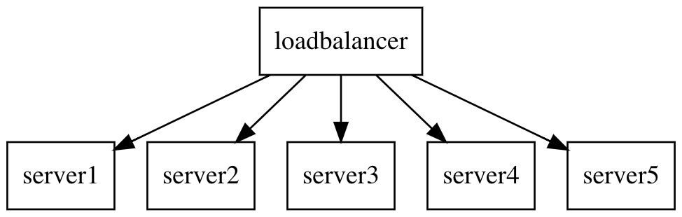

layout: true

class: center, middle

---

# Release it

## Production ready systems

By: David Soff

@SoffDavid

---

# Software is only useful in production

But most software is not necceseraly written with production in mind.

???

Software only delivers value in production.

---

# Does passing QA mean being ready for production?

---

---

---

> Programming today is a race between software engineers striving to build bigger and better idiot-proof programs, and the Universe trying to produce bigger and better idiots. So far, the Universe is winning.
> .origin[Rick Cook]

---

# Failure is expensive

???

A bug in a trading system can very quickly lose a company millions.

A wrong admin input can screw up the DNS and make a website unreachable.

A single broken request handler can bring down a server.

---

## Failure is ~~expensive~~ expected

---

# The bug that brought down an airline

???

A bug in the Oracle database driver caused the check-in kiosks to stop working
This bug made it so that connections to the database where not correctly closed after a failover.
This in turn caused the kiosk servers to run out of resources
A reboot of the affected applications fixed the problems

---

# So how to prevent the next outage?

> Bugs cannot be eliminated, so they must be survived instead.
> .origin[Michael T. Nygard]

---

# Goal

## Prevent bugs from causing a chain of failures

---
layout: true
class: left, middle

---

# Defining Stability

- **Transaction**: Abstract unit of work processed by the system.
- **System**: Everything needed to process a transaction.
- **Impulse**: A rapid shock to the system.
- **Stress**: A force applied to the system over a longer period of time.
- **Strain**: A change in the "shape" of the system caused by stress.

---

layout: true
class: center, middle

---

# Both *Impulses* and *Stress* can cause excessive *Strain*

---

# Impulse

---

# Stress

---

# Stability antipatterns

- Integration points
- Chain reactions
- Cascading failures
- Users
- Blocked threads
- Self-denial attacks
- Scaling effects
- Unbalanced capacities
- Dogpile
- Force multiplier
- Slow responses
- Unbounded result sets

---

# Stability antipatterns

- Integration points
- **Chain reactions**
- **Cascading failures**
- Users
- Blocked threads
- Self-denial attacks
- **Scaling effects**
- Unbalanced capacities
- Dogpile
- **Force multiplier**
- **Slow responses**
- **Unbounded result sets**

???

I will be talking about these specific antipatterns.

---

# Chain reactions

???

These happen in horizontally scaled apps. Once one of the nodes in the group crashes, the loadbalancer will distribute the load of that node to the other healthy nodes which as a result might also start failing. worst case this keeps happening untill all nodes are down and your service is unreachable.

IT may be the beginning of a cascading failure

---

# Cascading failures

???
These happen when an outage in one service also causes failures in other upstream and downstream services. This may be because of poorly isolated calls to the broken service. These can usually be prevented by employing Circuit-Breakers and Timeouts

---

# Cascading failures

---

# Cascading failures

---

# Cascading failures

---

# Scaling effects

???
Dont assume that the load between environments is the same.

More something to keep in mind, ACC does not have the same size as PROD.

More clients can mean more trouble, a backend server might be able to handle ten frontend services calling it, but it may crash when it is a hundred calling.

---

# Force multiplier

`rm -rf /`

???
Automation amplifying adverse effects because they can react very stupidly, very very quickly.

Fix this by defining "safe", and "unsafe" actions. Also add a goveror functionality which ensures automation cannot break loose.

---

# Slow responses

???
Slow responses can trigger cascading failures. They can also cause more load caused by users hitting the reload button.
Failing fast mitigated this problem by not having upstream systems wait for a response.

---

# Unbounded result sets

???
Title kinda explains this one.
If you call a service and it returns a huge list of data, you will have to be able to deal with that.
Also if you are writing queries, always add a limit clause otherwise you leave yourself open to sudden data growth issues.

---

# Stability patterns

- Timeouts
- Circuit breakers
- Bulkheads
- Steady state
- Fail fast
- Let it crash
- Handshaking
- Test harnesses
- Decoupling middleware
- Shed load
- Create back pressure
- Govenor

???
Let's get away from these dark patterns (wich pretty much every system has some of) and have a look at some stability patterns.
Expect failure, use these patterns to reduce impact.

---

# Stability patterns

- **Timeouts**
- **Circuit breakers**
- **Bulkheads**
- Steady state
- **Fail fast**
- Let it crash
- Handshaking
- **Test harnesses**
- **Decoupling middleware**
- Shed load
- **Create back pressure**
- **Govenor**
  
---

# Timeouts

???
Can be used for ensuring outgoing calls don't keep the system hanging forever. Think very carefully about the length of a timeout. Does is make sense to wait 60 seconds for a reply from a backend service before rendering the webpage a user requested?

---

# Circuit breakers

???

- Best used in conjunction with timeouts.
- They trigger on number of errors.
- A tripped circuitbreaker is bad and should be alerted on.

---

# Bulkheads

---

# Bulkheads

???

- Used to contain failures/ reduce the balst radius, just like the bulkheads in a ship are designed to ensure a single leak does not sink the ship.
- Partition single points of failure so that an issue with one of the partitions, doesn't bring down all dependent services.

---

# Fail fast

???

- Fail as fast as possible by checking your dependencies before doing big computations.
- Don't wait for resources to become available. the upstream system should be handling failure responses.

Example:

A print shop needs the fonts to be attached to a job otherwise the printer will pront a full black page.
The printer should therefore verify that the fonts are correctly attached before starting the full print run. Otherwise it should fail with a descriptive error message.

---

# Test harnesses

#### (AKA evil-twin service)

???

Basically a mock service which will try to simulate all different failure modes, this includes but is not limited to:

- slow responses
- slow connections
- wrong return types
- refuse all credentials
- etc
  
It will try to make the system under test hurt.

---

# Decoupling middleware

???

Decouple services by using async communication.

---

# Create back pressure

???
Mostly important for systems where work is pushed through the system.

Don't push more work onto a worker than it can process and let the worker communicate this back to the producer.

Block new work until it can be processed again. producer should notice and stop trying to send new work untill there is capacity again.

---

# Governor

???

Limit the speed at which "unsafe" actions can be performed e.g. shutting down servers or deleting data.

---

# Lessons

--

- Production is hard.

--

- Your software should be cynical.

---

# Thank you
